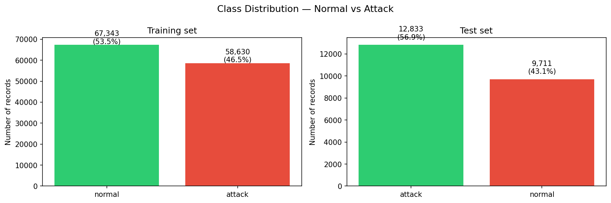
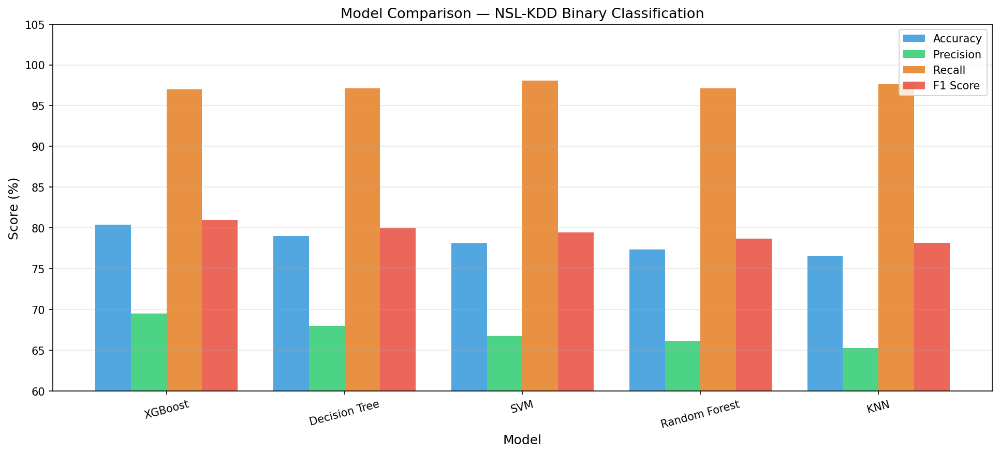
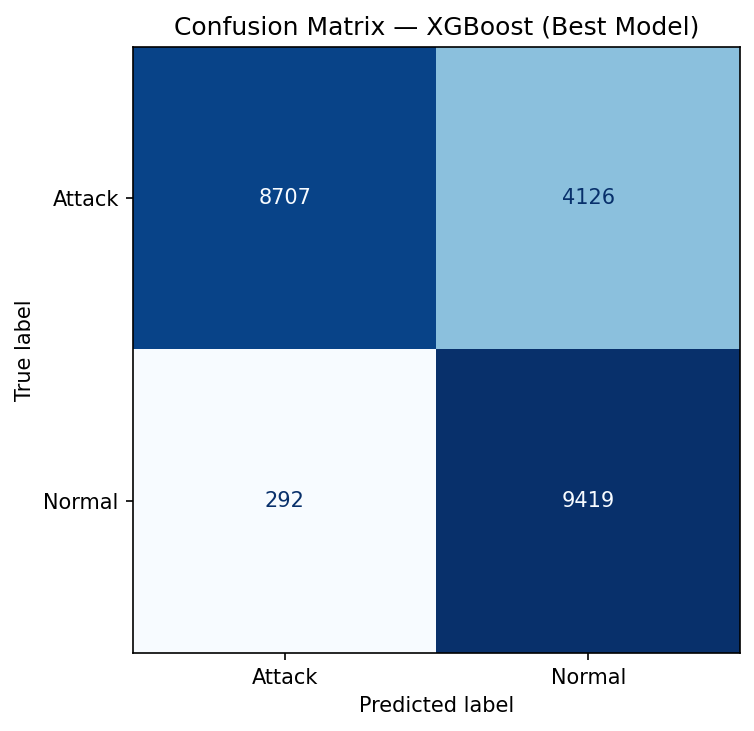
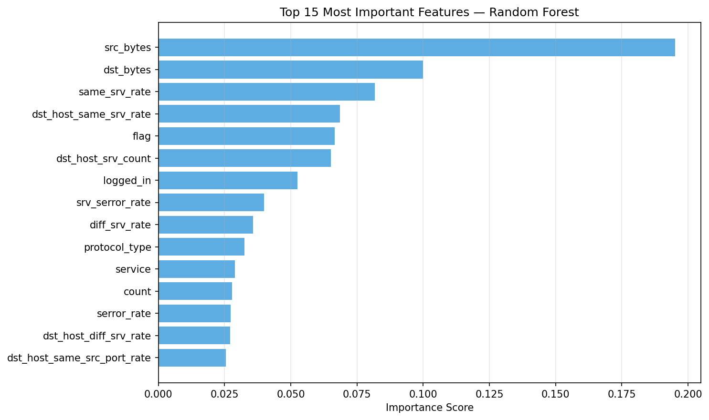

# Network Intrusion Detection System using Machine Learning

Detecting network attacks using five ML algorithms trained on the NSL-KDD benchmark dataset.

## Results

| Model         | Accuracy | Precision | Recall | F1 Score |
|---------------|----------|-----------|--------|----------|
| XGBoost       | 80.40%   | 69.54%    | 96.99% | 81.00%   |
| Decision Tree | 79.04%   | 67.97%    | 97.12% | 79.97%   |
| SVM           | 78.14%   | 66.76%    | 98.07% | 79.45%   |
| Random Forest | 77.34%   | 66.14%    | 97.14% | 78.69%   |
| KNN           | 76.57%   | 65.24%    | 97.62% | 78.21%   |

## Key Findings

- XGBoost achieved the highest F1 score of 81.00%
- Attack detection rate (Recall) of 97% — model correctly identified 8,707 out of 8,999 attacks
- False Positive Rate of 32.2% — highlights the precision-recall tradeoff in IDS design
- Only 292 attacks missed out of 8,999 total
- Top predictive features: src_bytes, dst_bytes, same_srv_rate

## Visualizations

## Dataset

NSL-KDD — University of New Brunswick  
125,973 training samples | 22,544 test samples | 41 features  
Download: https://www.kaggle.com/datasets/hassan06/nslkdd

## Tech Stack

Python 3.14 | Pandas | NumPy | Scikit-learn | XGBoost | Matplotlib | Seaborn | Jupyter

## How to Run

1. Clone this repository
2. Install dependencies: `pip install -r requirements.txt`
3. Download NSL-KDD from https://www.kaggle.com/datasets/hassan06/nslkdd
4. Place KDDTrain+.txt and KDDTest+.txt in the data/ folder
5. Run notebooks in order: 01 then 02 then 03 then 04

## Discussion

The high recall (97%) with moderate precision (69%) reflects a deliberate tradeoff in IDS design.
Failing to detect an attack is more costly than a false alarm. The 32.2% false positive rate
represents the primary limitation and points to future work in ensemble tuning and feature selection.

This project is part of a broader research investigation into cross-domain anomaly detection,
examining shared challenges between computer vision detection systems and network intrusion detection.
